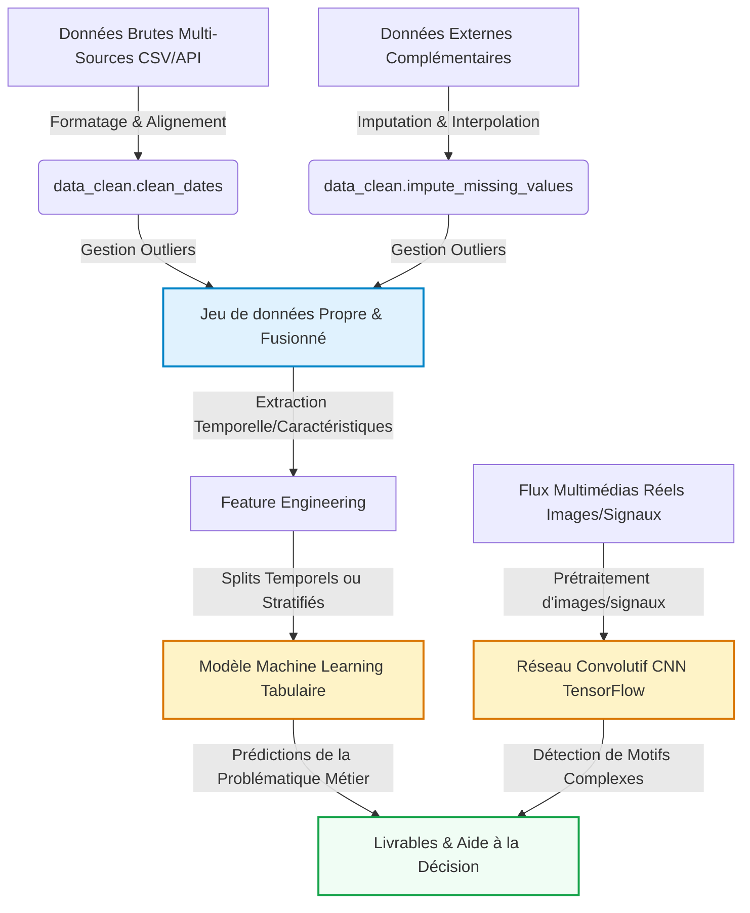

# Introduction et Contexte Métier {#sec-intro}

Ce projet s'inscrit dans le cadre du Projet Fil Rouge de la formation Data Science & IA d'IPSSI. L'équipe a choisi de s'attaquer à une problématique d'actualité : **prédire le résultat des matchs internationaux de football**, avec en ligne de mire la Coupe du Monde FIFA 2026 organisée aux États-Unis, au Canada et au Mexique.

## Contexte du Projet

Le football international est un terrain d'application particulièrement riche pour la Data Science. Les compétitions y sont nombreuses, l'enjeu économique et médiatique colossal, et les données librement disponibles couvrent **plus de 150 ans d'histoire** : le premier match international officiel oppose l'Écosse à l'Angleterre en 1872. Notre dataset principal recense aujourd'hui plus de **47 000 rencontres** entre sélections nationales.

Pourtant, prédire l'issue d'un match reste un défi. Niveau intrinsèque des équipes, dynamique récente, avantage du terrain, enjeu de la compétition, écart de classement FIFA, contexte historique — autant de signaux à combiner sans tomber dans le piège de la fuite de données (par exemple en utilisant une information qui n'existait pas encore au moment du match).

L'objectif de ce projet est de construire un pipeline de Data Science **complet et reproductible**, depuis l'acquisition des données jusqu'à un modèle prédictif rigoureusement évalué. Au-delà de l'exercice technique, l'enjeu métier est double :

- **expliquer** quels facteurs structurent réellement l'issue d'une rencontre internationale ;
- **prédire** les résultats à venir — en particulier ceux des 72 matchs programmés de la CDM 2026.

L'analyse quantitative est ici indispensable car l'intuition footballistique, aussi documentée soit-elle, ne suffit pas à arbitrer entre des hypothèses contradictoires : le classement FIFA est-il vraiment un bon prédicteur ? L'avantage à domicile résiste-t-il à l'ère des matchs en terrain neutre ? Le profil offensif d'une équipe se transmet-il d'une décennie à l'autre ? Seul un traitement statistique de l'historique permet de trancher.

## Objectif Analytique

La variable cible est le **résultat du match du point de vue de l'équipe recevante**, codé en trois modalités : `home_win`, `draw`, `away_win`. Il s'agit donc d'une tâche de **classification multi-classes**.

Le couplage multi-sources est au cœur de notre démarche. Quatre jeux de données complémentaires sont fusionnés au sein du notebook `01_acquisition` :

- les **résultats historiques** (`results.csv`, dataset *martj42/international_football_results*) fournissent la trame principale — date, équipes, score, tournoi, ville, pays, neutralité du terrain ;
- les **classements FIFA mensuels** (1992–2024) ajoutent un signal de niveau relatif des équipes, joint temporellement par `pd.merge_asof` pour éviter toute fuite ;
- les jeux annexes **`shootouts`** (tirs au but), **`goalscorers`** (buteurs) et **`former_names`** (anciens noms d'équipes) enrichissent et fiabilisent les jointures sur l'ensemble de l'historique.

Les livrables attendus à l'issue du Jalon 1 (exploration) sont :

1. un jeu de données **propre, fusionné et historiquement cohérent** (`data/processed/matches_clean.csv`, ~30 500 matchs exploitables) ;
2. un **audit visuel** de l'histoire du football international (volume, tournois majeurs, dominantes nationales, intensité offensive, ratios de victoire) ;
3. une **analyse exploratoire** statistique dégageant **cinq insights majeurs** qui orienteront la modélisation du Jalon 2.

---

# Acquisition et Préparation des Données (Data Wrangling) {#sec-wrangling}

Le succès de tout projet de Data Science repose sur la qualité de la préparation des données [@pandas2020]. Cette section documente l'audit de qualité et les étapes de nettoyage appliquées à vos jeux de données bruts.

## Chapitre 1 : Acquisition Multi-Sources


## Chapitre 2 : Nettoyage et Préparation (Wrangling)


---

# Visualisation Multidimensionnelle (Insights) {#sec-viz}

Nous présentons ici les résultats visuels clés permettant de dégager des insights exploitables pour les décideurs, en s'appuyant sur notre module `src/utils_viz.py`.

## Chapitre 3 : Travaux Pratiques d'Exploration Visuelle


---

# Analyse Exploratoire des Données (EDA) {#sec-eda}

Dans cette section, nous analysons les relations statistiques fondamentales qui régissent votre domaine d'étude au sein du jeu de données.

## Chapitre 4 : Travaux Pratiques d'Exploration (EDA)


---

# Modélisation et Apprentissage {#sec-modelling}

Le pipeline complet intègre à la fois la branche analytique tabulaire (Machine Learning) et la branche d'analyse visuelle ou de signaux complexes (Deep Learning CNN) :



## Chapitre 5 : Travaux Pratiques de Modélisation (ML & DL)


---

# Évaluation Métrique et Validation {#sec-evaluation}

Au-delà de l'*accuracy* — que le cours qualifie de « métrique de vanité » — le
modèle est évalué avec la batterie d'indicateurs adaptés aux classes
déséquilibrées : matrice de confusion, précision, rappel, F1-score et ROC-AUC.
Les hyperparamètres sont ensuite optimisés par recherche aléatoire en validation
croisée. Le modèle ainsi validé est enfin appliqué au **bracket officiel de la
phase à élimination directe** : la simulation des 16ᵉˢ de finale jusqu'à la
finale, complétée par une validation Monte-Carlo (20 000 tirages), désigne le
**champion du monde 2026 prédit** et quantifie l'incertitude de la compétition.

## Chapitre 6 : Travaux Pratiques d'Évaluation & Robustesse


---

# Data Storytelling et Communication {#sec-storytelling}

## Chapitre 7 : Travaux Pratiques de Storytelling


## Présentation des Résultats (Livrables Interactifs)

::: {.panel-tabset}

### 📺 Diaporama de Soutenance (RevealJS)
Ci-dessous est intégré le squelette de votre diaporama de soutenance RevealJS. Utilisez-le pour présenter votre démarche aux décideurs de façon professionnelle.

<iframe src="slides.html" width="100%" height="500px" style="border: 1px solid #e2e8f0; border-radius: 8px; background: white;"></iframe>

### 📊 Exemple de Dashboard Dynamique (OJS / Plotly)
Voici un exemple minimal de code montrant comment intégrer un graphique dynamique contrôlé par un composant d'interface utilisateur en Observable JS (OJS).

```{ojs}
//| echo: true
// Boutons de sélection interactifs OJS
viewof selectedCategory = Inputs.select(["Toutes", "A", "B", "C"], {value: "Toutes", label: "Filtrer par Catégorie :"})
```

```{ojs}
//| echo: false
// Données simulées réactives
data = [
  {timestamp: "2026-05-18T00:00:00Z", value: 10.5, category: "A"},
  {timestamp: "2026-05-18T02:00:00Z", value: 12.1, category: "A"},
  {timestamp: "2026-05-18T04:00:00Z", value: 14.7, category: "A"},
  {timestamp: "2026-05-18T05:00:00Z", value: 15.2, category: "A"},
  {timestamp: "2026-05-18T06:00:00Z", value: 16.0, category: "B"},
  {timestamp: "2026-05-18T07:00:00Z", value: 18.3, category: "B"},
  {timestamp: "2026-05-18T09:00:00Z", value: 21.5, category: "B"},
  {timestamp: "2026-05-18T10:00:00Z", value: 22.0, category: "B"},
  {timestamp: "2026-05-18T12:00:00Z", value: 25.4, category: "C"},
  {timestamp: "2026-05-18T13:00:00Z", value: 26.1, category: "C"},
  {timestamp: "2026-05-18T15:00:00Z", value: 28.9, category: "C"},
  {timestamp: "2026-05-18T16:00:00Z", value: 30.2, category: "C"}
]

// Filtrage réactif de la donnée
filteredData = selectedCategory === "Toutes" 
  ? data 
  : data.filter(d => d.category === selectedCategory)

// Tracé interactif avec la librairie Plotly
Plotly.newPlot('dynamic-chart', [{
  x: filteredData.map(d => d.timestamp),
  y: filteredData.map(d => d.value),
  type: 'scatter',
  mode: 'lines+markers',
  marker: {color: '#1A73E8', size: 8},
  line: {shape: 'spline', color: '#1A73E8', width: 3}
}], {
  title: 'Évolution Dynamique des Valeurs (Filtrée)',
  margin: {t: 50, b: 50, l: 50, r: 50},
  paper_bgcolor: 'rgba(0,0,0,0)',
  plot_bgcolor: 'rgba(0,0,0,0)',
  xaxis: {gridcolor: '#E5E7EB'},
  yaxis: {gridcolor: '#E5E7EB'}
})
```

<div id="dynamic-chart" style="width:100%; height:400px; background: white; border-radius: 8px; box-shadow: 0 4px 6px -1px rgba(0,0,0,0.1);"></div>

:::

---

# Utilisation de l'Intelligence Artificielle {#sec-ai}

Dans une démarche de transparence scientifique et académique, cette section détaille la manière dont les outils d'Intelligence Artificielle (IA) générative ont été intégrés tout au long de la réalisation de ce projet.

## Cartographie de l'utilisation de l'IA

| Outil d'IA | Cas d'usage (Pourquoi ?) | Méthode d'utilisation (Comment ?) | Rôle et Validation Humaine |
| :--- | :--- | :--- | :--- |
| **[Outil d'IA]** | *[À compléter par les étudiants]* | *[À compléter par les étudiants]* | *[À compléter par les étudiants]* |

## Principes de Rigueur et Responsabilité

1. **Responsabilité intellectuelle** : L'équipe assume l'entière responsabilité des analyses, des choix de modèles et des conclusions présentées dans ce rapport.
2. **Lutte contre les hallucinations** : Chaque suggestion technique a fait l'objet d'une validation empirique.
3. **Protection des données** : Aucun jeu de données confidentiel ou sensible n'a été soumis à des modèles tiers en ligne.

---

# Bibliographie {.unnumbered}

::: {#refs}
:::
